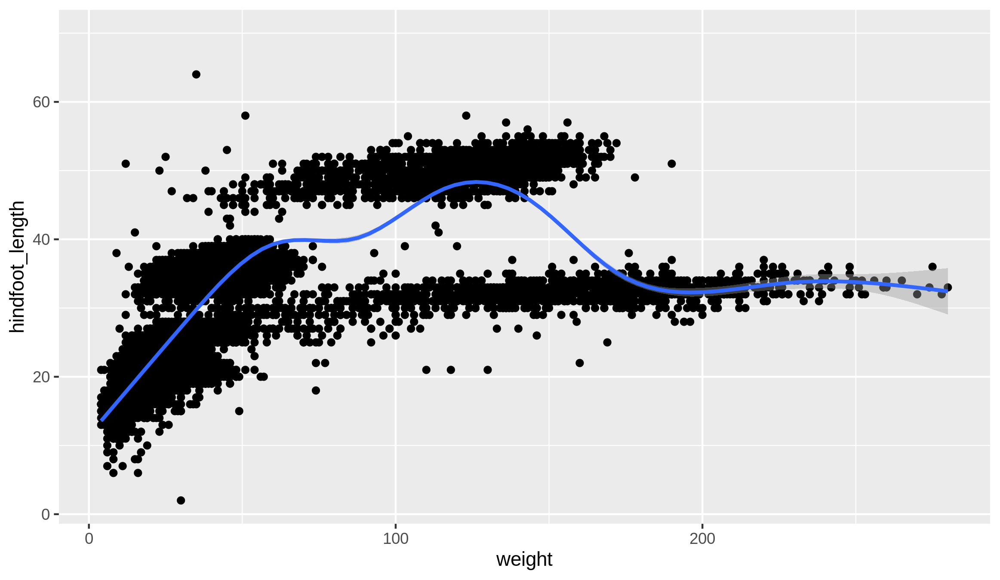

<!-- This is a comment -->

<!-- Headings -->


# Heading 1 {#heading1label}
This is a walkthrough of basic markdown

## Heading 2

### Heading 3

#### Heading 4
\
\

# Inline text formatting
To make text bold use **double asterisks** or __double underscore__\ <!-- "\" breaks line -->
To make text italic, use *single asterisks* or _single underscore_\
To make text superscript, use ^caret^\
To make text subscript, use ~tilde~\
To mark text as inline code, use `backticks`\
To mark text strikethrough, use ~~double tilde~~\
\
\
\
\
\
\
\
\
\
\
\
\
\


# Line breaks
Insert line breaks with backslash or double space\

# Links
Link to a webpage [Shared Document](https://docs.google.com/document/d/1N8gPLlwWvviLO4S4v5DgsZrafEeV2r4IeHu3KHDrWNc/edit#)\
Link to another place in doc [here](#heading1label)\
\

# Footnotes
\
To indicate a footnote, use[^1] and second footnote[^2]

[^1]: This is the first footnote
[^2]: This is the second footnote <!-- These don't need to go at end of doc -->

\

# Lists

Ordered lists (for sublists double indent):

1. Item 1
2. Item 2
3. Item 3
    a. Item 3a
        i. Item 3ai
    b. Item 3b
4. Item 4
\

Unordered lists (*, +, -):

- Item 1
- Item 2
    - Item 2.1
        - Item 2.1.1
- Item 3
\

Tasks list: <!-- these are only correctly rendered in github -->
- [] unchecked item
- [x] checked item
\

# Inserting figures
\
These will be figures that we have saved somewhere already, not those generated with R
\



# Tables
\


| Column 1 | Column 2 | Column 3 |
|----------|----------|----------|
| Item 1,1 | Item 1,2 | Item 1,3 |

\

| Left align | Center align | Right align |
|:-----------|:------------:|------------:|
| Item 1,1   | Item 1,2     | Item 1,3    |


# Blocks
\

text block\

> Example of block\
> some text

\

code block\

```
print("hello world")
x <- 1+2
print(x)
```

\

# Table of contents

\

set this at the top of the page in the yaml header\
yaml by default shows only 3 levels of headings\
toc_float = TRUE makes it look nice\

\

# How to cite inline

Citation to my paper @cardona2019 and @cardona2014

# References


